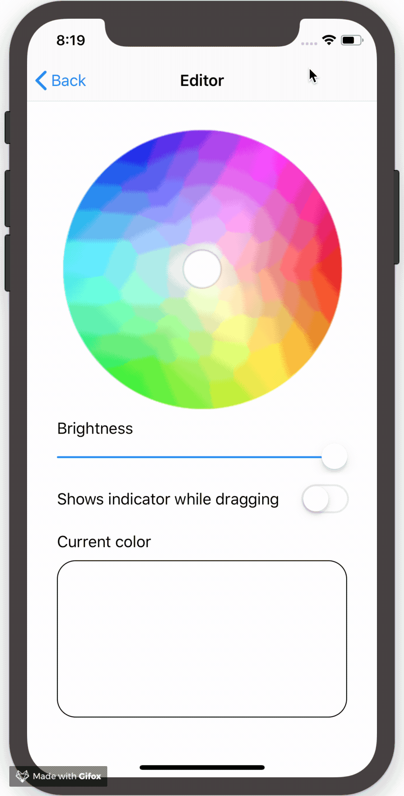

# ColorPicker

[](https://travis-ci.org/culumn/ColorPicker) [](https://github.com/Carthage/Carthage) [](https://cocoapods.org/pods/CULColorPicker) [](https://cocoapods.org/pods/ColorPicker) [](https://cocoapods.org/pods/ColorPicker)

This is the simple color picker for iOS.



## Usage
```swift
class ViewController: UIViewController, ColorPickerViewDelegate {

    @IBOutlet weak var colorPicker: ColorPickerView!

    override func viewDidLoad() {
        super.viewDidLoad()

        // Set delegate of color picker
        colorPicker.delegate = self
    }

    func colorPickerDidSelectColor(_ colorPicker: ColorPickerView) {
      // Can get the selected color from the color picker
      let color = colorPicker.selectedColor
    }
}
```

## Example
To run the example project, open the `Example/Example.xcworkspace`.

## Installation

### Swift Package Manager
In Xcode 11+, Go to File > Swift Packages > Add Package Dependencies… and paste the following Git URL into the text box: 
```
https://github.com/culumn/ColorPicker
```

### [CocoaPods](https://cocoapods.org)
ColorPicker is available through [CocoaPods](https://cocoapods.org). To install it, simply add the following line to your `Podfile`:

```ruby
pod 'CULColorPicker'
```

### [Carthage](https://github.com/Carthage/Carthage)
Add the following line to your `Cartfile`:
```bash
github "culumn/ColorPicker"
```

## Requirements
- iOS 9.0+
- Xcode 10.0
- Swift 4.2

## Author

culumn, [@culumn](https://github.com/culumn)

## License

ColorPicker is available under the MIT license. See the LICENSE file for more info.
